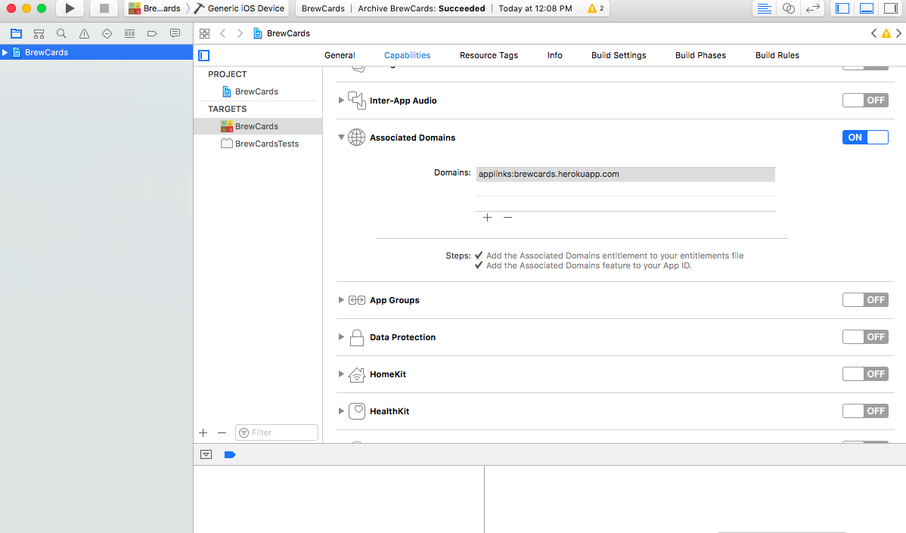

# Universal Linking For React-Native with Rails API, and Deep Linking Android
Just a tutorial on how to set up Universal Linking for iOS with a Rails server, and Deep Linking on an Android device.

## iOS
- Universal Linking allows users to click on a link from a text message or email and your app will `magically` launch

- You can pass information in the url of link so your app can launch to a specific screen and fetch the proper data

- The documentation from Apple is not the best, I will explain in extreme detail how to accomplish this with `React-Native` and a `Rails` server

### Requirements

1.  You have to set up your server
2.  Your server must use HTTPS or else the set-up sucks and and these instructions will not work for you
2.  The links you provide to users should go to a valid web page should they not have the app installed.  It's a fallback and good UX.
3.  You have to have a developer account with iTunes to test on your device
4.  You have to configure your app to handle the link/parse it for pertinent information.

#### Universal Linking does not support iOS < 9.  You want to support old versions of iOS, great...good for you.  I hope you support old versions of IE as well...  I do not support these old things.  I also think everyone should always use flex-box...always...no exceptions :)

### Server Configuration

This is where the Apple doc's didn't really help that much.  I use Rails servers and the set-up instructions weren't the best for my use case.

<br>
1.  Your link should go to a valid web page. <br><br>
  - for instance the link `https://brewcards.herokuapp.com/bars/1` goes to a web page.  Should the user click the link and the app is not installed, then Safari will open to a web page.  In this example I am going to extract the `1` from the url and re-direct the user to the proper app screen and fetch data.<br><br>

2.  Your server has to have a route that is defined as a `get` with the path `/apple-app-site-association`  **you can not change this name**<br><br>
  -  Rails example `get '/apple-app-site-association' => 'whatever#whatever_method'` <br><br>

3.  When a request is made to that path, you must return the proper file with the proper configuration. <a href="https://developer.apple.com/library/content/documentation/General/Conceptual/AppSearch/UniversalLinks.html#//apple_ref/doc/uid/TP40016308-CH12-SW1">Apple docs do a great job explaining this file configuration.  Click here to see how to structure your file</a>    <br><br>

4.  Apple says the the file has to have a certain name and certain location.  This is not true.  You can name the file whatever the eff you want as long as you return it when the request is made to the `apple-app-site-association` url and there is no extension on the file.  It may be JSON format, just don't put .anything as the extension<br><br>
  - In Rails, I put the file in the `public` directory<br><br>


## My controller in Rails


```ruby

class WhateverController < ApplicationController

 def whatever_method
   send_file "#{Rails.root}/public/whatever_I_named_my_apple_association_file_with_no_extension", {:type => "application/json"}
 end

end

```  

# Server Configuration Done

# App Configuration

1.  In X-Code turn on Associated Domains
2.  Add your domain.
3.  Make sure to prefix the domain with `applinks:` in place of `https://`



### <a href="https://facebook.github.io/react-native/docs/linking-libraries-ios.html#manual-linking">Add RCTLinking to your project</a>
Do what is says in the link about. **Make sure to add the library to the header search path as recursive**


### Modify App Delegate

```objc
#import "RCTLinkingManager.h" // import

// ADD THIS METHOD

- (BOOL)application:(UIApplication *)application continueUserActivity:(NSUserActivity *)userActivity
 restorationHandler:(void (^)(NSArray * _Nullable))restorationHandler
{
 return [RCTLinkingManager application:application
                  continueUserActivity:userActivity
                    restorationHandler:restorationHandler];
}


```

### Handle the links in your app.

-  There are two scenarios you must account for.
1.  Your app is closed and gets opened via the `Universal Linking` we have enabled or `Deep Linking Android`
2.  Your app is running in the background and is `woke up` from the `Universal Linking` or `Deep Linking`

In your app's Navigator, add some methods to handle the Universal Linking.

```js

  componentDidMount(){
    // this handles the case where the app is closed and is launched via Universal Linking.
    Linking.getInitialURL()
        .then((url) => {
          if (url) {
            // Alert.alert('GET INIT URL','initial url  ' + url)
            this.resetStackToProperRoute(url)
          }
        })
        .catch((e) => {})

   // This listener handles the case where the app is woken up from the Universal or Deep Linking
   Linking.addEventListener('url', this.appWokeUp);
  }

  componentWillUnmount(){
    // Remove the listener
    Linking.removeEventListener('url', this.appWokeUp);
  }

  appWokeUp = (event) => {
    // this handles the use case where the app is running in the background and is activated by the listener...
    // Alert.alert('Linking Listener','url  ' + event.url)
    this.resetStackToProperRoute(event.url)
  }

  resetStackToProperRoute = (url) => {
    // grab the trailing portion of the url so we can use that data to fetch proper information from the server
    let trailing = url.slice(url.lastIndexOf('/') + 1,url.length)
    // reset the stack, let your properly coded application handle everything and populate everthing.
    this.props.resetStack([ BarsMain, { ...BarDetail, id:parseInt(trailing) } ])
  }
```


# Universal Linking....Boom.

# Android

Android is a little easier...no server configuration

1.  Add an `<intent-filter>` to you `AndroidManifest.xml`
2.  Describe what url scheme you want handled.
3.  Profit?

```xml
<!-- Add an Intent filter withing your       
  <activity
    android:name=".MainActivity"
    android:label="@string/app_name"
    android:configChanges="keyboard|keyboardHidden|orientation|screenSize">

    ...rest of stuffs

    ....the intent filter below...
  </activity>
 -->


 <!-- This is how you structure your Intent filter -->
<intent-filter>
  <!-- This is just configuration -->
  <action android:name="android.intent.action.VIEW" />
  <category android:name="android.intent.category.DEFAULT" />
  <category android:name="android.intent.category.BROWSABLE" />

  <!-- This is the important stuff. Link to Android docs below -->
  <data android:scheme="https"
        android:host="brewcards.herokuapp.com"
        android:pathPrefix="/bars" />

</intent-filter>

```

<a href="https://developer.android.com/training/app-indexing/deep-linking.html#adding-filters">The `<data />` attribute is the important stuff.  It defines what url schemes to intercept read about it here </a>

# Deep Linking...Boom.
